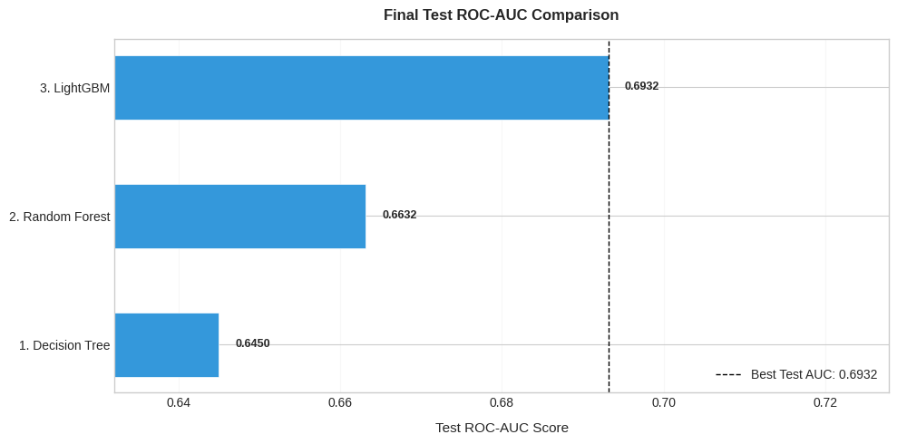
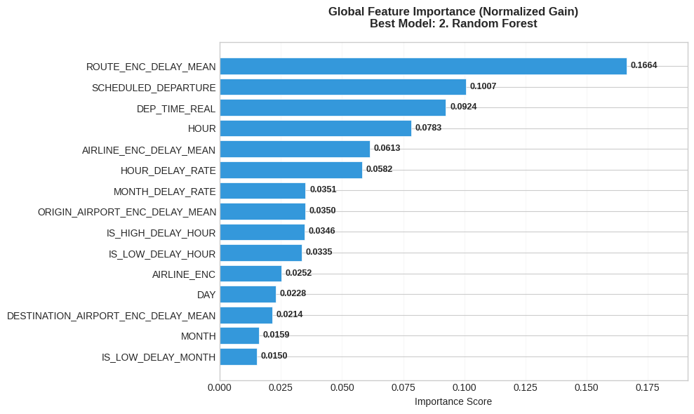

# Flight Delay Prediction — Ensemble Methods

> Predicting US domestic flight delays (≥15 min) using ensemble ML
> from a single Decision Tree to Random Forest to LightGBM,
> with leak-free feature engineering and business threshold analysis.

---

## Results

| Model | CV ROC-AUC | Test ROC-AUC |
|-------|-----------|-------------|
| Decision Tree (baseline) | 0.6677 ± 0.0007 | 0.6450 |
| Random Forest | 0.6846 ± 0.0012 | 0.6632 |
| LightGBM | 0.7126 ± 0.0011 | 0.6932 |

*Trained on 500,000 flights (stratified sample of 5,819,079 total)*

---

## Dataset

**Source:** [2015 Flight Delays — Kaggle](https://www.kaggle.com/datasets/usdot/flight-delays)

| File | Rows | Description |
|------|------|-------------|
| `flights.csv` | 5,819,079 | One row per flight |
| `airlines.csv` | 14 | Carrier code -> full name |
| `airports.csv` | 322 | Airport code -> city, coordinates |

**Target:** `DEPARTURE_DELAY >= 15 min` (binary)  
**Class balance:** 81.2% on-time / 18.8% delayed -> ROC-AUC used, not accuracy

---

## Key Concepts

**Why ROC-AUC, not Accuracy**  
A model that always predicts "on-time" scores 81.25% accuracy while being
completely useless. ROC-AUC measures ranking ability and equals 0.5 for
a random classifier regardless of class balance.

**Leak-free Feature Engineering**  
All thresholds (high-delay months, hours, airports) are computed from
training data only via `compute_thresholds()`, then applied identically
to train and test. Post-departure columns (`TAXI_OUT`, `WHEELS_OFF`,
`DEPARTURE_TIME`) are excluded — they are not available at prediction time.

**KFold Target Encoding**  
Mean delay rate per carrier/airport/route is computed using KFold:
each training row is encoded from the *other folds only*, never from itself.
This prevents naive target encoding from inflating CV scores a subtle
leakage that caused ~0.009 AUC overestimation in earlier runs.

---

## Top Features

## Tech Stack

Python · scikit-learn · LightGBM · pandas · NumPy · matplotlib · seaborn · joblib

---

*By Nurgul Kalymbet | [LinkedIn](https://linkedin.com/in/nurgulkalymbet)*
